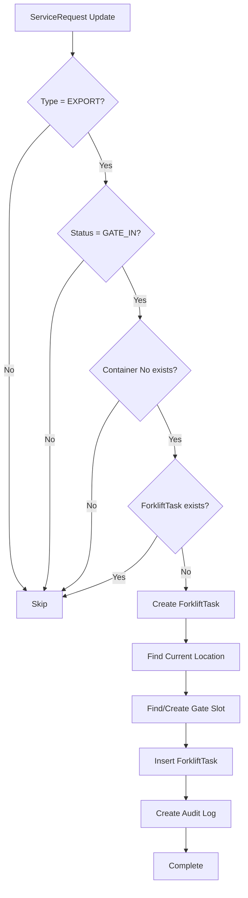

# Auto Forklift Task Creation - EXPORT Requests

## Overview
Hệ thống tự động tạo phiếu forklift cho các request EXPORT khi chuyển sang trạng thái `GATE_IN`. Tính năng này đảm bảo việc di chuyển container từ bãi yard ra cổng gate được thực hiện một cách tự động và có hệ thống.

## Architecture

### 1. Database Trigger (PostgreSQL)
**File**: `manageContainer/backend/prisma/migrations/20250904_auto_create_forklift_task.sql`

```sql
-- Trigger tự động tạo forklift task khi ServiceRequest chuyển sang GATE_IN
CREATE OR REPLACE FUNCTION create_forklift_task_for_export()
RETURNS TRIGGER AS $$
DECLARE
    existing_task_count INTEGER;
    gate_slot_id TEXT;
    gate_yard_id TEXT;
    gate_block_id TEXT;
    current_location_slot_id TEXT;
BEGIN
    -- Chỉ xử lý khi request type = EXPORT và status = GATE_IN
    IF NEW.type = 'EXPORT' AND NEW.status = 'GATE_IN' AND NEW.container_no IS NOT NULL THEN
        -- Kiểm tra xem đã có forklift task chưa
        SELECT COUNT(*) INTO existing_task_count
        FROM "ForkliftTask"
        WHERE container_no = NEW.container_no;
        
        -- Nếu chưa có task, tạo mới
        IF existing_task_count = 0 THEN
            -- Logic tạo forklift task...
        END IF;
    END IF;
    
    RETURN NEW;
END;
$$ LANGUAGE plpgsql;

-- Tạo trigger
CREATE TRIGGER trigger_auto_create_forklift_task
    AFTER UPDATE ON "ServiceRequest"
    FOR EACH ROW
    EXECUTE FUNCTION create_forklift_task_for_export();
```

### 2. Service Layer (TypeScript)
**File**: `manageContainer/backend/modules/forklift/service/AutoForkliftTaskService.ts`

```typescript
export class AutoForkliftTaskService {
  /**
   * Tự động tạo forklift tasks cho các EXPORT requests có status GATE_IN
   * mà chưa có forklift task
   */
  static async createMissingForkliftTasks(): Promise<void> {
    // Tìm tất cả EXPORT requests có status GATE_IN
    const exportGateInRequests = await prisma.serviceRequest.findMany({
      where: {
        type: 'EXPORT',
        status: 'GATE_IN',
        container_no: { not: null }
      }
    });

    // Tạo forklift task cho từng request chưa có
    for (const request of exportGateInRequests) {
      if (!request.container_no) continue;
      
      const existingTask = await prisma.forkliftTask.findFirst({
        where: { container_no: request.container_no }
      });

      if (!existingTask) {
        await this.createForkliftTaskForExport(
          request.container_no,
          request.gate_checked_by || request.created_by
        );
      }
    }
  }

  /**
   * Tạo forklift task cho EXPORT request
   */
  static async createForkliftTaskForExport(containerNo: string, actorId: string): Promise<void> {
    // Tìm vị trí hiện tại của container trong yard
    const currentLocation = await prisma.yardPlacement.findFirst({
      where: { 
        container_no: containerNo, 
        status: { in: ['HOLD', 'OCCUPIED'] } 
      }
    });

    // Tìm hoặc tạo slot đặc biệt cho gate
    let gateSlot = await prisma.yardSlot.findFirst({
      where: { 
        code: 'GATE_EXPORT',
        block: { code: 'GATE' }
      }
    });

    // Tạo ForkliftTask mới
    const forkliftTask = await prisma.forkliftTask.create({
      data: {
        container_no: containerNo,
        from_slot_id: currentLocation?.slot_id || null,
        to_slot_id: gateSlot.id,
        status: 'PENDING',
        assigned_driver_id: null,
        created_by: actorId,
        cost: 0
      }
    });

    // Ghi audit log
    await audit(actorId, 'FORKLIFT.AUTO_CREATED', 'ForkliftTask', forkliftTask.id, {
      container_no: containerNo,
      trigger: 'AUTO_SERVICE_GATE_IN_EXPORT',
      from_slot_id: currentLocation?.slot_id || null,
      to_slot_id: gateSlot.id,
      task_purpose: 'Move container from yard to gate for export'
    });
  }
}
```

### 3. State Machine Integration
**File**: `manageContainer/backend/modules/requests/service/RequestStateMachine.ts`

```typescript
export class RequestStateMachine {
  static async executeTransition(
    actor: any,
    requestId: string,
    currentState: string,
    newState: string,
    reason?: string,
    additionalData?: any
  ): Promise<void> {
    // ... validation logic ...

    // Tự động tạo forklift task cho EXPORT requests khi chuyển sang GATE_IN
    if (newState === 'GATE_IN' && additionalData?.requestType === 'EXPORT' && additionalData?.containerNo) {
      try {
        await AutoForkliftTaskService.createForkliftTaskForExport(
          additionalData.containerNo, 
          actor._id
        );
        console.log(`✅ Auto-created forklift task for EXPORT container ${additionalData.containerNo}`);
      } catch (error) {
        console.error(`❌ Error auto-creating forklift task for container ${additionalData.containerNo}:`, error);
        // Không throw error để không ảnh hưởng đến việc chuyển trạng thái
      }
    }
  }
}
```

## Workflow

### 1. Request State Transition
```
EXPORT Request: PENDING → SCHEDULED → SENT_TO_GATE → GATE_IN
                                                      ↓
                                              Auto-create ForkliftTask
                                                      ↓
                                              Status: PENDING
                                              From: Yard Slot
                                              To: GATE_EXPORT Slot
```

### 2. Database Flow


## Key Features

### 1. Automatic Detection
- **Trigger**: Khi ServiceRequest chuyển sang status `GATE_IN`
- **Condition**: Chỉ áp dụng cho request type `EXPORT`
- **Validation**: Kiểm tra container_no có tồn tại

### 2. Duplicate Prevention
- Kiểm tra xem đã có ForkliftTask cho container chưa
- Chỉ tạo task mới nếu chưa tồn tại
- Tránh tạo duplicate tasks

### 3. Location Management
- **From Location**: Tìm vị trí hiện tại của container trong yard
- **To Location**: Tìm hoặc tạo slot đặc biệt `GATE_EXPORT`
- **Gate Infrastructure**: Tự động tạo Yard/Block/Slot cho gate nếu chưa có

### 4. Audit Trail
- Ghi log mọi hoạt động tạo task
- Track actor thực hiện (gate_checked_by hoặc created_by)
- Metadata chi tiết về task purpose và locations

## Database Schema

### ForkliftTask Model
```prisma
model ForkliftTask {
  id                  String   @id @default(cuid())
  container_no        String
  from_slot_id        String?  // Vị trí hiện tại trong yard
  to_slot_id          String?  // Vị trí đích: GATE_EXPORT slot
  status              String   // PENDING | IN_PROGRESS | COMPLETED | CANCELLED
  assigned_driver_id  String?
  created_by          String
  cost                Float?   @default(0)
  createdAt           DateTime @default(now())
  updatedAt           DateTime @updatedAt
}
```

### YardSlot for Gate
```prisma
model YardSlot {
  id          String   @id @default(cuid())
  code        String   // 'GATE_EXPORT'
  status      String   // 'RESERVED'
  kind        String   // 'EXPORT'
  near_gate   Int      // 10 (ưu tiên cao)
  avoid_main  Int      // 0
  is_odd      Boolean  // false
  block_id    String
  block       YardBlock @relation(fields: [block_id], references: [id])
}
```

## API Integration

### 1. Manual Trigger
```typescript
// POST /api/forklift/auto-create-missing
// Tạo forklift tasks cho các EXPORT requests hiện tại
await AutoForkliftTaskService.createMissingForkliftTasks();
```

### 2. Scheduled Check
```typescript
// Cron job hoặc scheduled task
// Chạy định kỳ để đảm bảo không bỏ sót
await AutoForkliftTaskService.runScheduledCheck();
```

## Error Handling

### 1. Database Errors
- **Constraint Violations**: Handle duplicate key errors
- **Foreign Key Errors**: Ensure referenced records exist
- **Transaction Rollback**: Rollback on any error

### 2. Service Errors
- **Container Not Found**: Skip if container_no is null
- **Location Not Found**: Use fallback location or skip
- **Gate Slot Creation Failed**: Log error but continue

### 3. State Machine Errors
- **Non-blocking**: Errors không ảnh hưởng đến state transition
- **Logging**: Ghi log chi tiết để debug
- **Retry Logic**: Có thể retry sau khi state transition hoàn tất

## Testing

### 1. Unit Tests
```typescript
// Test AutoForkliftTaskService
describe('AutoForkliftTaskService', () => {
  it('should create forklift task for EXPORT request', async () => {
    const result = await AutoForkliftTaskService.createForkliftTaskForExport(
      'TEST1234567', 
      'user-id'
    );
    expect(result).toBeDefined();
  });
});
```

### 2. Integration Tests
```typescript
// Test state machine integration
describe('RequestStateMachine', () => {
  it('should auto-create forklift task on GATE_IN transition', async () => {
    await RequestStateMachine.executeTransition(
      mockActor,
      'request-id',
      'SENT_TO_GATE',
      'GATE_IN',
      undefined,
      { requestType: 'EXPORT', containerNo: 'TEST1234567' }
    );
    
    const task = await prisma.forkliftTask.findFirst({
      where: { container_no: 'TEST1234567' }
    });
    expect(task).toBeDefined();
  });
});
```

### 3. Database Trigger Tests
```sql
-- Test trigger functionality
UPDATE "ServiceRequest" 
SET status = 'GATE_IN' 
WHERE type = 'EXPORT' AND container_no = 'TEST1234567';

-- Verify forklift task was created
SELECT * FROM "ForkliftTask" WHERE container_no = 'TEST1234567';
```

## Monitoring & Logging

### 1. Audit Logs
```typescript
// Audit log structure
{
  actor_id: string,
  action: 'FORKLIFT.AUTO_CREATED',
  entity: 'ForkliftTask',
  entity_id: string,
  meta: {
    container_no: string,
    trigger: 'GATE_IN_EXPORT' | 'AUTO_SERVICE_GATE_IN_EXPORT',
    from_slot_id: string | null,
    to_slot_id: string,
    task_purpose: string
  }
}
```

### 2. Console Logs
```typescript
// Success logs
console.log(`✅ Auto-created forklift task for EXPORT container ${containerNo}`);

// Error logs  
console.error(`❌ Error auto-creating forklift task for container ${containerNo}:`, error);

// Info logs
console.log(`🔍 Checking for missing forklift tasks...`);
console.log(`📋 Found ${exportGateInRequests.length} EXPORT requests with GATE_IN status`);
```

## Configuration

### 1. Environment Variables
```env
# Enable/disable auto-creation
AUTO_FORKLIFT_CREATION_ENABLED=true

# Gate slot configuration
GATE_SLOT_CODE=GATE_EXPORT
GATE_BLOCK_CODE=GATE
GATE_YARD_NAME=Gate Yard
```

### 2. Database Configuration
```sql
-- Gate slot properties
near_gate: 10        -- High priority for gate
avoid_main: 0        -- Not avoid main area
is_odd: false        -- Not odd position
status: 'RESERVED'   -- Reserved for gate operations
kind: 'EXPORT'       -- Export-specific slot
```

## Future Enhancements

### 1. Advanced Features
- **Priority Management**: Different priorities for different container types
- **Route Optimization**: Calculate optimal routes for forklift operations
- **Capacity Planning**: Predict gate slot capacity needs
- **Real-time Updates**: WebSocket notifications for task creation

### 2. Integration Improvements
- **Mobile Notifications**: Notify drivers about new tasks
- **Dashboard Updates**: Real-time dashboard updates
- **Reporting**: Analytics on auto-created tasks
- **Bulk Operations**: Handle multiple containers at once

### 3. Performance Optimizations
- **Batch Processing**: Process multiple requests in batches
- **Caching**: Cache frequently accessed data
- **Async Processing**: Use message queues for heavy operations
- **Database Indexing**: Optimize database queries

## Troubleshooting

### 1. Common Issues
- **Missing Gate Infrastructure**: System will auto-create if missing
- **Container Not in Yard**: Task created with null from_slot_id
- **Duplicate Tasks**: Prevention logic should handle this
- **Permission Errors**: Ensure proper role permissions

### 2. Debug Steps
1. Check ServiceRequest status and type
2. Verify container_no exists
3. Check existing ForkliftTask records
4. Review audit logs for errors
5. Test manual task creation

### 3. Recovery Procedures
- **Manual Task Creation**: Use AutoForkliftTaskService.createMissingForkliftTasks()
- **Data Cleanup**: Remove duplicate or invalid tasks
- **Infrastructure Setup**: Ensure gate yard/block/slot exist
- **Permission Fix**: Update user roles and permissions

## Related Documentation

- [FORKLIFT_ACTION_MAPPING.md](./FORKLIFT_ACTION_MAPPING.md) - Forklift action mappings
- [Forklift.md](./Forklift.md) - Main forklift module documentation
- [REQUEST_STATE_MACHINE_API.md](./REQUEST_STATE_MACHINE_API.md) - State machine API
- [MODULE_3_REQUESTS.md](./MODULE_3_REQUESTS.md) - Requests module documentation
