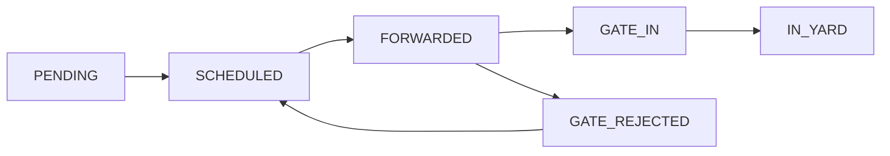

# Module 4: Gate - Quản lý cổng ra/vào

## Tổng quan

Module Gate xử lý việc kiểm soát xe ra/vào cổng container yard. Sau khi bộ phận kho chuyển tiếp chứng từ, Gate sẽ so sánh thông tin tài xế với chứng từ gốc để quyết định cho xe vào hay từ chối.

## State Machine



### Các trạng thái mới:
- `FORWARDED`: Chứng từ đã được chuyển tiếp từ Kho sang Gate
- `GATE_IN`: Gate xác nhận cho xe vào cổng
- `GATE_REJECTED`: Gate từ chối xe, có lý do cụ thể

## Database Schema

### ServiceRequest Model
```prisma
model ServiceRequest {
  // ... existing fields
  status            String   // PENDING | SCHEDULED | FORWARDED | GATE_IN | GATE_REJECTED | REJECTED | COMPLETED | EXPORTED | IN_YARD | LEFT_YARD
  forwarded_at      DateTime?
  forwarded_by      String?
  gate_checked_at   DateTime?
  gate_checked_by   String?
  gate_reason       String?
  // ... other fields
}

Ghi chú:
- Từ nay không dùng trạng thái `RECEIVED`; trạng thái khởi tạo do SaleAdmin tạo là `SCHEDULED`.
- Migration đã cập nhật dữ liệu cũ: `RECEIVED` → `SCHEDULED`, `SENT_TO_GATE` → `FORWARDED`.
```

## API Endpoints

Tất cả endpoint của module Gate đều được mount dưới tiền tố `/gate` và được bảo vệ bởi middleware `authenticate` ở `main.ts`:

```ts
app.use('/gate', authenticate, gateRoutes);
```

### 1. Forward Request (Kho → Gate)
```http
PATCH /gate/requests/:id/forward
Authorization: Bearer <token>
Role: SaleAdmin
```

**Chức năng**: Chuyển tiếp request từ trạng thái `SCHEDULED` sang `FORWARDED`

**Response**:
```json
{
  "message": "Đã chuyển tiếp request sang Gate thành công",
  "data": {
    "id": "req_123",
    "status": "FORWARDED",
    "forwarded_at": "2025-01-17T10:00:00Z",
    "forwarded_by": "user_456"
  }
}
```

### 2. Gate Approve (Gate → GATE_IN/GATE_OUT)
```http
PATCH /gate/requests/:id/approve
Authorization: Bearer <token>
Role: SaleAdmin
```

**Chức năng**: Gate approve request, chuyển trạng thái dựa trên loại. Từ nay bắt buộc truyền `license_plate` trong body để lưu lại biển số.
- `IMPORT` → `GATE_IN`
- `EXPORT` → `GATE_OUT`

**Body**:
```json
{ "license_plate": "51C-123.45" }
```

**Response**:
```json
{
  "message": "Đã approve request thành công",
  "data": {
    "id": "req_123",
    "status": "GATE_IN",
    "gate_checked_at": "2025-01-17T10:30:00Z",
    "gate_checked_by": "sale_admin_456"
  }
}
```

### 3. Gate Reject
```http
PATCH /gate/requests/:id/reject
Authorization: Bearer <token>
Role: SaleAdmin
```

**Body**:
```json
{
  "reason": "Thiếu chứng từ hải quan"
}
```

**Response**:
```json
{
  "message": "Đã từ chối request thành công",
  "data": {
    "id": "req_123",
    "status": "REJECTED",
    "gate_reason": "Thiếu chứng từ hải quan",
    "rejected_reason": "Thiếu chứng từ hải quan",
    "rejected_by": "sale_admin_456",
    "rejected_at": "2025-01-17T10:35:00Z"
  }
}
```

### 4. Search Requests
```http
GET /gate/requests/search?status=FORWARDED&container_no=ISO123&type=IMPORT&page=1&limit=20
Authorization: Bearer <token>
Role: YardManager | SaleAdmin
```

**Query Parameters**:
- `status`: FORWARDED | GATE_IN | GATE_REJECTED
- `container_no`: Tìm kiếm theo mã container
- `type`: IMPORT | EXPORT | CONVERT
- `page`: Số trang (default: 1)
- `limit`: Số item mỗi trang (default: 20)

### 5. Get Request Details
```http
GET /gate/requests/:id
Authorization: Bearer <token>
Role: YardManager | SaleAdmin
```

## Business Logic

### 1. Forward Request
- Kiểm tra request có tồn tại và có trạng thái `SCHEDULED`
- Cập nhật trạng thái thành `FORWARDED`
- Ghi nhận thời gian và người chuyển tiếp
- Audit log: `REQUEST.FORWARDED` (entity: `ServiceRequest`)

### 2. Gate Processing
- Chỉ xử lý request có trạng thái `FORWARDED`
- So sánh thông tin tài xế với chứng từ gốc
- Nếu khớp → `GATE_IN`
- Nếu không khớp → `GATE_REJECTED` với lý do cụ thể

### 3. Validation Rules
- Tên tài xế: Bắt buộc, 2-100 ký tự
- Biển số xe: Bắt buộc, 5-20 ký tự
- CMND/CCCD: Bắt buộc, 9-20 ký tự
- Số seal: Tùy chọn, tối đa 50 ký tự
- Lý do từ chối: Bắt buộc, 10-500 ký tự

## Audit & Security

### Audit Logs
- `REQUEST.FORWARDED`: Khi kho chuyển tiếp sang Gate
- `REQUEST.GATE_IN`: Khi Gate chấp nhận xe vào
- `REQUEST.GATE_REJECTED`: Khi Gate từ chối xe

### Role-based Access Control
- Sử dụng middleware `requireRoles(...roles)`
- **SaleAdmin**: Có thể forward request
- **YardManager**: Có thể gate-accept, gate-reject, search, get details
- **SaleAdmin + YardManager**: Đều có thể search và xem chi tiết

Ví dụ định tuyến:

```ts
router.patch('/requests/:id/forward', requireRoles('SaleAdmin'), gateController.forwardRequest);
router.patch('/requests/:id/gate-accept', requireRoles('YardManager'), gateController.acceptGate);
router.patch('/requests/:id/gate-reject', requireRoles('YardManager'), gateController.rejectGate);
router.get('/requests/search', requireRoles('YardManager', 'SaleAdmin'), gateController.searchRequests);
router.get('/requests/:id', requireRoles('YardManager', 'SaleAdmin'), gateController.getRequestDetails);
```

## Error Handling

### Common Errors
- `Request không tồn tại`: ID request không hợp lệ
- `Chỉ có thể forward request có trạng thái SCHEDULED`: Trạng thái không phù hợp
- `Chỉ có thể xử lý request có trạng thái FORWARDED`: Request chưa được forward
- `Dữ liệu không hợp lệ`: Validation error từ DTO

### Error Response Format
```json
{
  "message": "Mô tả lỗi",
  "error": "Chi tiết validation error (nếu có)"
}
```

## Integration Points

### 1. Với Module Requests
- Sử dụng chung `ServiceRequest` model
- Kế thừa validation và business rules

### 2. Với Module Audit
- Sử dụng hàm `audit(actorId, action, entity, entityId, meta)` thay vì lớp `AuditService`
- Tự động log tất cả actions với entity `ServiceRequest`
- Tracking đầy đủ thông tin người thực hiện

### 4. Prisma & Migration
- Sau khi thay đổi schema, chạy `npx prisma generate` để cập nhật types
- Khi triển khai, dùng `npx prisma migrate deploy` để áp dụng migration
- Migration chuyển đổi trạng thái lịch sử: `RECEIVED` → `SCHEDULED`, `SENT_TO_GATE` → `FORWARDED`

### 3. Với Frontend
- Real-time updates qua WebSocket (future)
- Notification system cho kho khi Gate từ chối

## 1) Mục tiêu
- Check-in/Check-out tại cổng, tốc độ và chính xác
- Đối chiếu lịch hẹn, in phiếu Gate IN/OUT, audit đầy đủ

## 2) RBAC & Gate Mode
- Gate Mode chỉ cho phép khi request kèm header `x-device-type: gate` và `x-device-id` thuộc danh sách tin cậy `GATE_DEVICE_IDS` (ENV)
- Quyền: SaleAdmin trên Gate Device, hoặc SystemAdmin
- Check-out: nếu chính người đã RECEIVED, bắt buộc `supervisor_pin` (ENV: `GATE_SUP_PIN`)

## 3) Data model liên quan (Prisma)
- Sử dụng `ServiceRequest.status` mở rộng: `IN_YARD`, `LEFT_YARD`
- Lịch sử lưu trong `ServiceRequest.history` với các action: `GATE_CHECKIN`, `GATE_CHECKOUT`

## 4) API
- `GET /gate/lookup?code=` → tìm request theo mã (id/container_no). SLA ≤ 300ms. Audit: `GATE.LOOKUP`
- `POST /gate/checkin` body `{ request_id, plate_no }` → trạng thái `IN_YARD`. Audit: `GATE.CHECKIN`
- `POST /gate/checkout` body `{ request_id, supervisor_pin? }` → trạng thái `LEFT_YARD`. Audit: `GATE.CHECKOUT`
- `POST /gate/print` body `{ request_id, type: 'IN'|'OUT' }` → trả metadata in phiếu. Audit: `GATE.PRINT`

## 5) Liên kết Module
- Module 3: sử dụng `ServiceRequest` và history để đồng bộ luồng. Cho phép `IN_YARD` từ `RECEIVED|COMPLETED`, `LEFT_YARD` từ `IN_YARD`.
- Module 2: JWT dùng để xác định `role` và audit `actor_id`. Middleware GateMode kế thừa `authenticate`.
- Module 1: Audit log dùng cơ chế chung; scope tenant không thay đổi vì Gate chạy nội bộ depot.

## 6) Checklist triển khai
- Middleware `gateMode` kiểm tra thiết bị
- Dto validation: lookup/checkin/checkout/print
- Controller/Service cho lookup, checkin, checkout, print
- Cập nhật prisma + Request state machine

## 7) Ghi chú in ấn
- Bản demo trả metadata; sản phẩm thực dùng service sinh PDF (PDFKit) + lưu S3/Blob + gửi lệnh in cục bộ

## 8) Bản đồ mã nguồn (Code map)
- Backend
  - DTO: `modules/gate/dto/GateDtos.ts`
  - Middleware Gate Mode: `modules/gate/middleware/gateMode.ts`
  - Service: `modules/gate/service/GateService.ts`
  - Controller: `modules/gate/controller/GateController.ts`
  - Routes: `modules/gate/controller/GateRoutes.ts`
  - Mount routes: `main.ts` (`app.use('/gate', gateRoutes)`)
  - Liên quan Module 3 (Requests): cập nhật state machine hỗ trợ `IN_YARD`/`LEFT_YARD` tại `modules/requests/service/RequestService.ts` và DTO `modules/requests/dto/RequestDtos.ts`
  - Prisma (không tạo bảng riêng cho Gate; tái sử dụng `ServiceRequest`)
- Frontend
  - Trang Gate: `frontend/pages/Gate/index.tsx`
  - API client: `frontend/services/gate.ts` (gửi headers `x-device-type`, `x-device-id`)
  - RBAC helper: `frontend/utils/rbac.ts` (`canUseGate`)
  - Dashboard entry: `frontend/pages/Dashboard/index.tsx` (card Gate)


