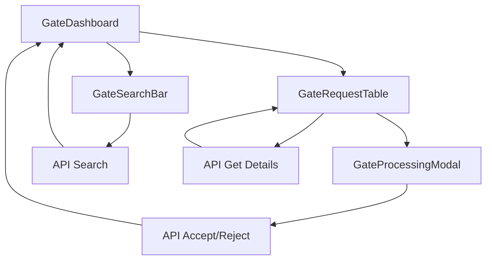

# Frontend Gate Module

## Tổng quan

Module Gate Frontend cung cấp giao diện để nhân viên cổng xử lý xe ra/vào container yard. Module này tích hợp với backend Gate API để thực hiện các thao tác kiểm soát cổng.

## Cấu trúc thư mục

```
frontend/pages/Gate/
├── index.tsx                    # Trang chính Gate
├── components/                  # Các components con
│   ├── GateDashboard.tsx       # Dashboard chính
│   ├── GateSearchBar.tsx       # Thanh tìm kiếm và lọc
│   ├── GateRequestTable.tsx    # Bảng hiển thị requests
│   ├── GateProcessingModal.tsx # Modal xử lý xe vào cổng
│   └── index.ts                # Export components
└── styles/
    └── gate.css                # CSS cho Gate module
```

## Components

### 1. GateDashboard
**File**: `components/GateDashboard.tsx`

**Chức năng**: Component chính quản lý toàn bộ Gate dashboard

**State**:
- `requests`: Danh sách requests cần xử lý
- `loading`: Trạng thái loading
- `searchParams`: Tham số tìm kiếm
- `pagination`: Thông tin phân trang

**Props**: Không có

**Methods**:
- `fetchRequests()`: Tải danh sách requests từ API
- `handleSearch()`: Xử lý tìm kiếm
- `handlePageChange()`: Xử lý thay đổi trang
- `handleStatusChange()`: Xử lý thay đổi trạng thái filter

### 2. GateSearchBar
**File**: `components/GateSearchBar.tsx`

**Chức năng**: Thanh tìm kiếm và lọc requests

**Props**:
```typescript
interface GateSearchBarProps {
  searchParams: {
    status: string;
    container_no: string;
    type: string;
  };
  onSearch: (params: Partial<GateSearchBarProps['searchParams']>) => void;
  onStatusChange: (status: string) => void;
  onContainerSearch: (container_no: string) => void;
  onTypeChange: (type: string) => void;
}
```

**Features**:
- Tìm kiếm theo mã container
- Lọc theo trạng thái (FORWARDED, GATE_IN, GATE_REJECTED)
- Lọc theo loại (IMPORT, EXPORT, CONVERT)
- Nút xóa bộ lọc

### 3. GateRequestTable
**File**: `components/GateRequestTable.tsx`

**Chức năng**: Hiển thị danh sách requests dạng bảng

**Props**:
```typescript
interface GateRequestTableProps {
  requests: GateRequest[];
  loading: boolean;
  onRefresh: () => void;
}
```

**Features**:
- Hiển thị thông tin container, loại, ETA, trạng thái
- Hiển thị số lượng chứng từ
- Nút hành động cho từng request
- Modal xử lý xe vào cổng

### 4. GateProcessingModal
**File**: `components/GateProcessingModal.tsx`

**Chức năng**: Modal xử lý xe vào cổng

**Props**:
```typescript
interface GateProcessingModalProps {
  request: GateRequest;
  visible: boolean;
  onClose: () => void;
}
```

**Features**:
- **Cột trái**: Hiển thị thông tin chứng từ
- **Cột phải**: Form nhập thông tin tài xế
- **Hai chế độ**: Chấp nhận xe hoặc từ chối xe
- **Validation**: Kiểm tra dữ liệu bắt buộc

### 5. GateActionButtons
**File**: `components/GateActionButtons.tsx`

**Chức năng**: Component xử lý các hành động approve/reject tại Gate

**Props**:
```typescript
interface GateActionButtonsProps {
  requestId: string;
  requestType: string; // IMPORT | EXPORT | CONVERT
  currentStatus: string;
  onActionSuccess: () => void;
}
```

**Features**:
- **Approve Button**: Chuyển trạng thái dựa trên loại request
  - `IMPORT` → `GATE_IN`
  - `EXPORT` → `GATE_OUT`
- **Reject Button**: Mở modal nhập lý do từ chối
- **Validation**: Lý do từ chối phải có ít nhất 5 ký tự
- **Status Display**: Hiển thị trạng thái hiện tại khi không thể action

**State Management**:
- `isRejectModalOpen`: Điều khiển modal từ chối
- `rejectReason`: Lưu lý do từ chối
- `isLoading`: Hiển thị trạng thái loading

**API Integration**:
- `PATCH /gate/requests/:id/approve` - Approve request
- `PATCH /gate/requests/:id/reject` - Reject request với lý do

## Data Flow



## API Integration

### 1. Search Requests
```typescript
const response = await api.get(`/gate/requests/search?${params.toString()}`);
setRequests(response.data.data);
setPagination(response.data.pagination);
```

### 2. Accept Gate
```typescript
await api.patch(`/gate/requests/${request.id}/gate-accept`, driverInfo);
```

### 3. Reject Gate
```typescript
await api.patch(`/gate/requests/${request.id}/gate-reject`, { reason: rejectReason });
```

## State Management

### Local State
- Sử dụng React hooks (`useState`, `useEffect`)
- Không cần global state management
- State được quản lý ở component level

### Data Fetching
- Sử dụng `api` service từ `@services/api`
- SWR cho caching (có thể implement trong tương lai)
- Manual refresh sau khi thực hiện actions

## Styling

### CSS Architecture
- **File**: `styles/gate.css`
- **Approach**: Component-specific CSS
- **Features**: Responsive design, modern UI components

### Key CSS Classes
- `.main-content`: Wrapper chính của trang Gate. Component thêm class `sidebar-visible` hoặc `sidebar-hidden` để tự động đổi kích thước theo trạng thái sidebar.
- `.dashboard-header`: Phần tiêu đề trang (gradient, shadow)
- `.gate-search-section`: Khu vực tìm kiếm/lọc
- `.gate-table`: Khung bảng danh sách
- `.status-badge`: Badge trạng thái
- `.pagination`, `.pagination-btn`, `.pagination-info`: Điều khiển phân trang

### Responsive Design
- Mobile-first approach
- Grid layout cho desktop, stack layout cho mobile
- Flexible search bar
- Kết hợp với class `sidebar-visible/sidebar-hidden` để tối đa không gian khi đóng/mở sidebar

### Tương thích Sidebar (Auto-resize theo trạng thái Sidebar)

Để trang Gate tự động thay đổi kích thước khi người dùng đóng/mở sidebar (giống trang Depot), chúng ta áp dụng cơ chế sau:

- Component `GateDashboard` theo dõi trạng thái của sidebar bằng `MutationObserver`:
  - Sidebar được coi là đóng khi phần tử `.sidebar` có class `closed`.
  - Fallback: theo dõi class trên `document.body` (`with-sidebar`) nếu không tìm thấy sidebar.
- Dựa trên trạng thái phát hiện được, component thêm class vào thẻ `main`:
  - `main-content sidebar-visible` khi sidebar mở
  - `main-content sidebar-hidden` khi sidebar đóng

Ví dụ (trích đoạn quan trọng trong `components/GateDashboard.tsx`):

```